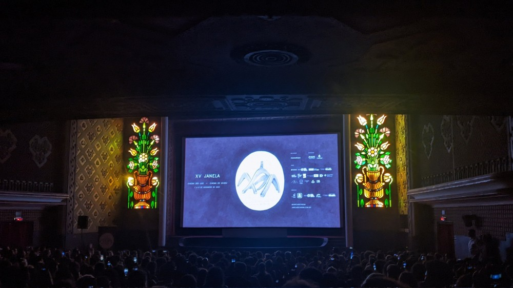

Hoje fui pra pré-estreia do novo filme de Walter Salles aqui em Recife, no cinema mais bonito do país, quiça do mundo, o cinema São Luiz que acaba de ser reinagurado após uma nova reforma. Sério, olha como essa sala de cinema é linda. E claro que o diretor não poderia deixar de estar presente nesse grandioso e lindo evento, que contou com a presença também da governadora de Pernambuco, Raquel Lyra (que inclusive essa semana foi anunciado na imprensa sua saída do PSDB pro PSD). Alias, o próprio Walter Salles ficou falando repetidas vezes que o Cinema São Luiz é a sala mais bonita de todas. 

Mas enfim, voltando pro cinema, foi extremamente conseguir comprar o ingresso que inicialmente esgotou em menos de 1 seg do início das vendas online. Tive que ficar 15 minutos atualizando a página pra surgir algum ingresso abandonado por alguém que não conseguiu concluir o pagamento.

No final meu esforço hercúleo foi desprezado pois na hora a organização simplesmente deixou quem não tinha ingresso entrar pra ver o filme. A sala ficou lotada e os "infiltrados" ficaram sentados no chão na frente da tela, o que Kleber Mendonça chamou de "praia" -- ele disse que antigamente essa área dianteira tinha cadeiras antes da reforma de 2010 e que a última vez que as pessoas sentaram na "praia" foi no mesmo festival "Janela Internacional" durante a exibição de Tubarão, em 2012 (poético). Destaque para o ator Humberto Carrão que também ficou sentado no chão.

O filme é incrível, muito bem feito, muito bem atuado, com um roteiro muito bom. Realmente acredito no potencial de ser indicado ao Oscar. [Dei 5 estrelas pro filme no Letterbox](https://letterboxd.com/filipemosca/film/im-still-here-2024-1/) e fiquei me achando por estar entre os 3.000 primeiros usuários a "logar" o filme na plataforma. E olha que eu não saio dando 5 estrelas pra qualquer filme, sou realmente criterioso e acho que Ainda Estou Aqui mais do que merece cada estrela.

Essa semana o filme vai estreias nos cinemas e vou assistir de novo.

