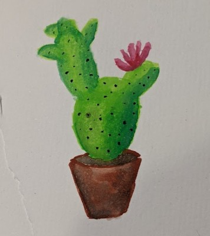
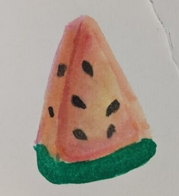
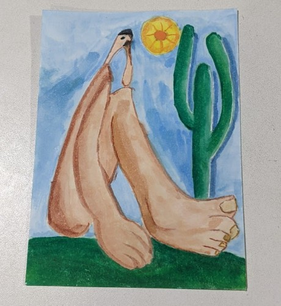
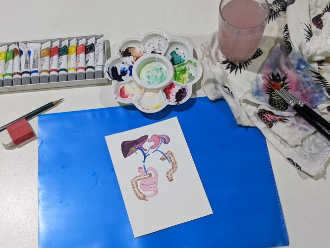

Em dezembro (de 2024, mês que escrevo) eu encontrei meu estojo de tintas da Pentel que comprei em meados de 2016 que estava completamente abandonado no fundo de uma gaveta. As tintas já estão vencidas mas deu uma vontade enorme de testar novamente se eu ainda sei pintar alguma coisa.

Despretensiosamente comecei a pintar e até que me impressionei com o resultado de formas simples como o cacto e a melancia abaixo.

Me empolguei e comecei a me interessar e assistir vários conteúdos no YouTube sobre aquarela. E assim reacendi um hobbie antigo que durou muito pouco mas sempre tive vontade de retornar. Pela faculdade muito corrido e pelos estudos pra prova de residência não tinha muito espaço na minha rotina.

Depois resolvi fazer minha versão de Abaporu da Tarsila do Amaral de 1928. Acabou parecendo que o personagem tem fungo nos pés porque fiz uma mistura de cores e no meio da pintura a tinta acabou, não consegui fazer uma nova mistura com o mesmo tom que já estava no papel.

Também tentei dar uma de Netter e pintar um pouco de anatomia humana...

Vou postando aqui minha jornada neste novo (ressuscitado) hobbie.